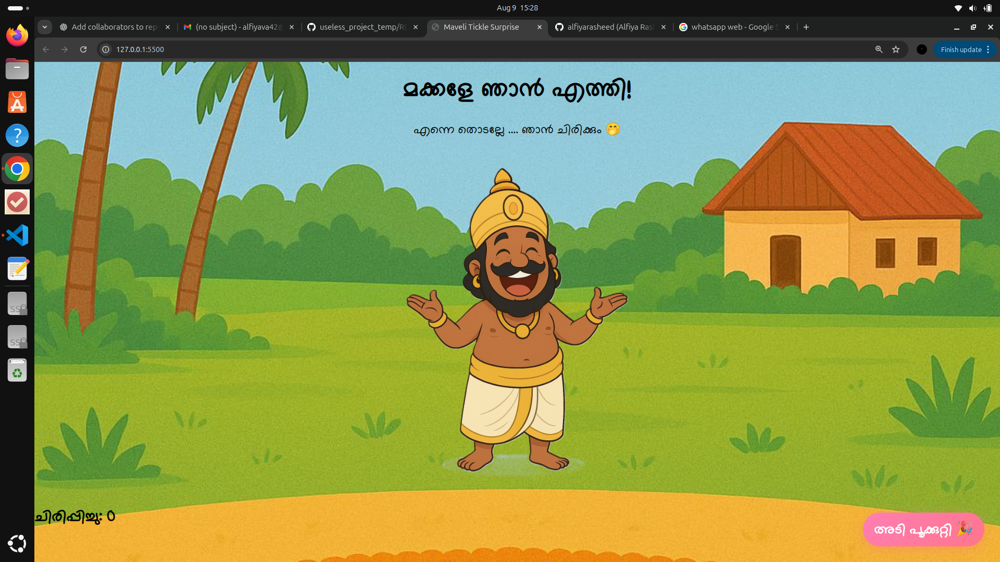

# Maveli_Tickle 🎯
Maveli Tickle Surprise is a playful web page celebrating Onam with the character Maveli. When users click or tap Maveli’s image, he gets “tickled,” triggering an animation and increasing a live tickle counter. The site features Malayalam greetings, responsive design for all devices, and a party button that launches colorful confetti. Built with simple HTML, CSS, and JavaScript, it’s lightweight and fun.  

## Basic Details
### Team Name: Mamma mia

### Team Members
- Member 1: Alfiya Rasheed - ICET
- Member 2: Diya P - ICET

### Project Description
Maveli Tickle Surprise is a playful web page celebrating Onam with the character Maveli. When users click or tap Maveli’s image, he gets “tickled,” triggering an animation and increasing a live tickle counter. The site features Malayalam greetings, responsive design for all devices, and a party button that launches colorful confetti. Built with simple HTML, CSS, and JavaScript, it’s lightweight and fun.  

### The Problem (that doesn't exist)
The counting of Tickles in Maveli

### The Solution (that nobody asked for)
Counting the tickles in Maveli

## Technical Details
### Technologies/Components Used
For Software:
- Html
- CSS
- JavaScript

# Screenshots

  
*This shows the homepage UI*

  
*This shows the live counting of tickles*

  
*This shows Party pop*

## Team Contributions
- Alfiya Rasheed: Add Styling to the page
- Diya P: Add the page structure and functionalities

---
Made with ❤️ at TinkerHub Useless Projects 

